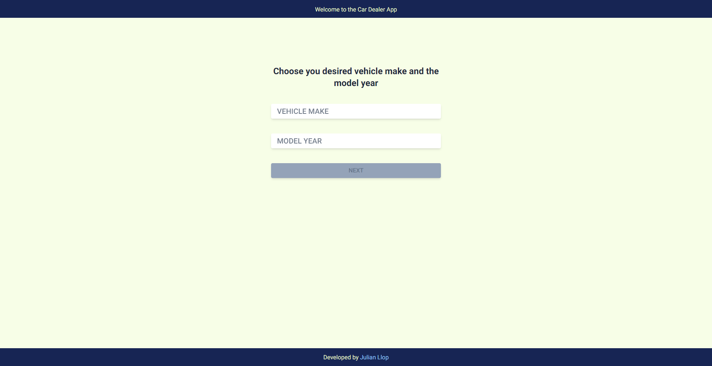
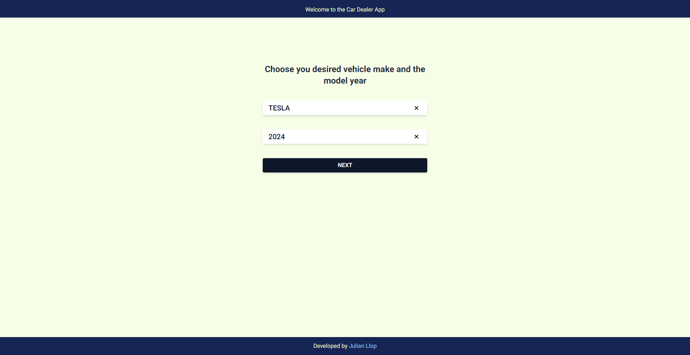
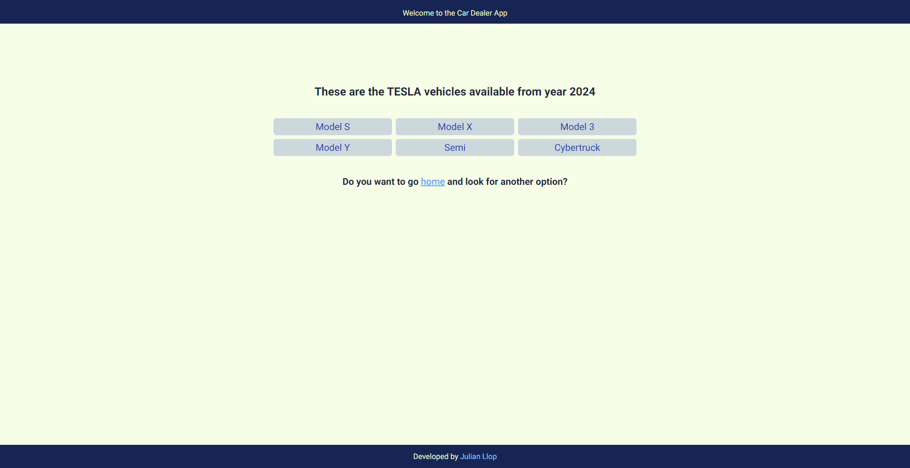

## Getting Started

First, open the terminal at /car-dealer-app and install node_modules:

```bash
npm i
# or
npm install
```

Once you have all dependecies installed you can run the development server:

```bash
npm run dev
# or
yarn dev
# or
pnpm dev
# or
bun dev
```

Open [http://localhost:3000](http://localhost:3000) with your browser to see the result.

## How should it look once you open [http://localhost:3000](http://localhost:3000)?

You should be able to see this view:



You may notice you can't go anyware if you press the "NEXT" button.

That's okay, only if you choose a Vehicle Make and a Year Model you will be able to press the button and it's going to
look like this:



Now you can press the "NEXT" button and you will be redirected to /result/[makeId]/[year] and it will show all vehicles
available from that Make and that Year you chose.

Take a look:



As you can tell you can press the "home" link which it's going to redirect you to the home screen where you can start
over with other options.

## Stop the application

Type the next comand on your terminal and press enter:

```bash
Ctrl + C
```

## Some information about the project

This application is developed in Next.js which allows the developers to make use of advanced concepts in frontend
developement, such as File-Based Routing which means each file inside the pages folder in Next.js automatically defines
a route, and one of the main reasons why people choose Next over React is Server-Side Rendering(SSR) and Static
Generation(SSG): Next.js supports both server-side rendering and static site generation. This means the result routes
will be pre-rendered at build time(SSG). This enhances load speed and Search Engine Optimization(SEO).

For the styling Tailwind CSS is a pretty fast way to make your app look good and modern thans to the predefined classes
you can use on your components to make a uniform UI.
